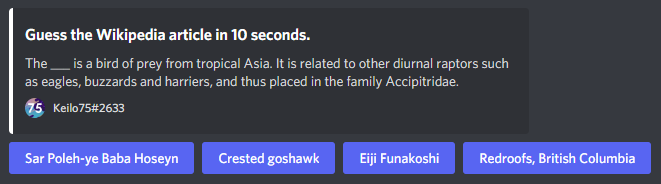

# wikiguesser
A discord bot which lets you guess the title of wikipedia articles.



# Commands
`play` - Start a game.  
`user` - Get information about a user's statistics.  
`toggleprivate` - Toggle wheter other users can see your stats.  
`about` - Show information about the bot.  
`ping` - Get the bots ping.  

# Contributing
If you want to contribute, feel free to simply fork the repository and submit a PR.

### Things to do:
- Add Leaderboards (Either global or per server)
- Add support for other languages (not possible with the REST API)

### Prerequisites
- [Node.js](https://nodejs.org/en/) (Version 14.0.0 or newer)
- [MongoDB](https://www.mongodb.com/)

### Installation
1. [Create a discord bot account](https://discord.com/developers/applications) and copy the token.
2. Clone the repository and run `npm install`.
3. Create a `config.json` in the root directory like this:
```
{
  "wiki": {
    "userAgent": "Add a user agent here.",
    "url": "https://en.wikipedia.org/api/rest_v1/page/random/summary"
  },
  "dbURL": "Add the URL to your database here.",
  "token": "Add your bot token.",
  "colors": {
    "white": "#FFFFFF",
    "red": "#ED4245",
    "green": "#57F287" 
  },
  "isDev": true
}
```
4. If you're coding, set `isDev` to true. Otherwise, registering new slash commands may take up to an hour.
5. Run `npm run start` to start the bot. You should now see it online!

Note:  
To add a new command, create a new file in a subdirectory of the `commands` folder and copy the content of `commands/commandTemplate.ts`. Start the bot and type `!deploy`. If `isDev` is set to true, it'll immediately add the commands to the server you typed the command in. 

# Help
If you're experiencing a bug or you have a suggestion, feel free to create an issue or message me on Discord (Keilo75#2633).
