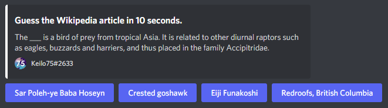

# wikiguesser

A discord bot which lets you guess the title of wikipedia articles. It can be accessed using the [invitation link](https://discord.com/oauth2/authorize?client_id=858792027235024896).



# Commands

`play` - Start a game.  
`user` - Get information about a user's statistics.  
`about` - Show information about the bot.

# Contributing

If you want to contribute, feel free to simply fork the repository and submit a PR.

## Prerequisites

- [Node.js](https://nodejs.org/en/) (Version 14.0.0 or newer)

## Local Setup

1. [Create a discord bot account](https://discord.com/developers/applications) and copy the token.
2. Clone the repository and run `npm install`.
3. Create a `.env` file in the root directory with the following values:

```
DISCORD_TOKEN=__
CLIENT_ID=__
GUILD_ID=__
DB_PATH=./storage.db
```

4. Run `npm run scripts:prepare-storage` to create a sqlite database.
5. If you're running a local copy, please consider changing the user agent in the `config.json` file.

## Scripts

These scripts can be run with `npm run <script>`:

- `start`: Starts the bot.
- `dev`: Starts the bot and automatically reloads on file change.
- `lint`: Run ESLint.
- `scripts:register-commands:dev`: Register commands to a specific guild (`CLIENT_ID` and `GUILD_ID` environment variables must be set).
- `scripts:register-commands:prod`: Register commands globally (`CLIENT_ID` environment variable must be set).

# Help

If you're experiencing a bug or you have a suggestion, feel free to create an issue or message me on Discord (Keilo75#2633).
